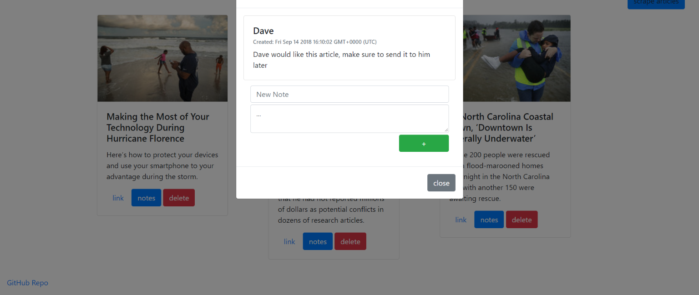

# MongoDB NYT Scraper
### live demo: https://nyt-mongoscraper.herokuapp.com/

## Technologies
* Node
* Express
* Handlebars
* Bootstrap
* jQuery
* MongoDB
* Mongoose
* Cheerio
* Request-promise

## How it Works

### This app uses request and cheerio to scrape the New York Times for the most recent articles, simply press the 'scrape articles' button to retrieve new articles

### Once articles have been returned the user can save the articles of their choosing with the 'save' button

### Saved articles can be noted by pressing the 'notes' button or the user can press the 'delete' button to get rid of saved articles they are finished with

